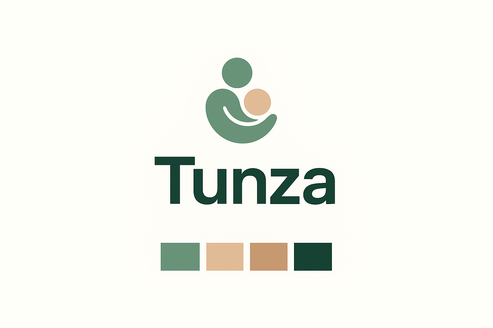
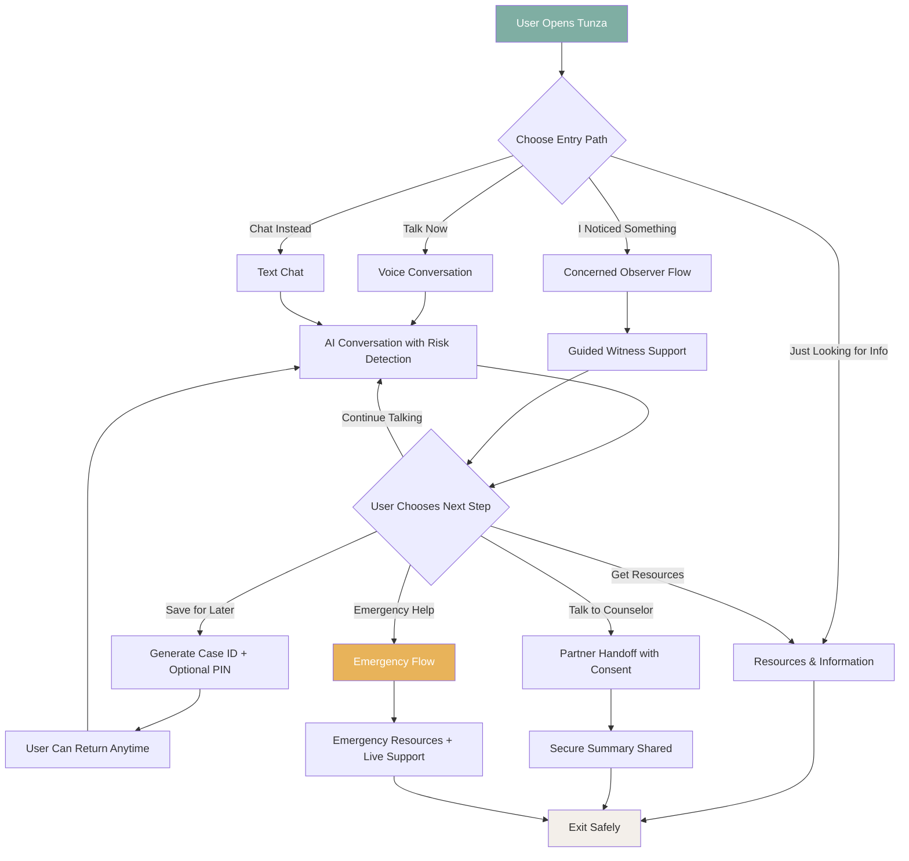
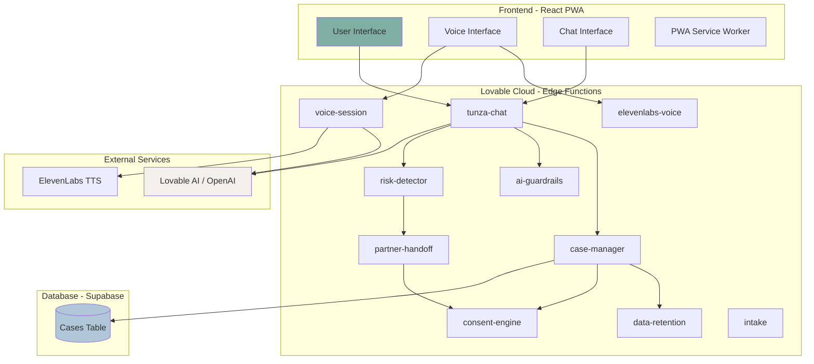
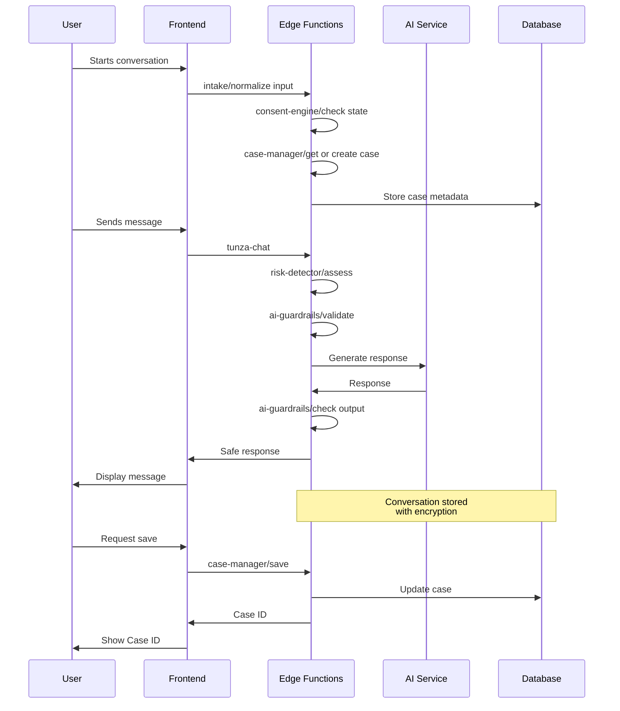
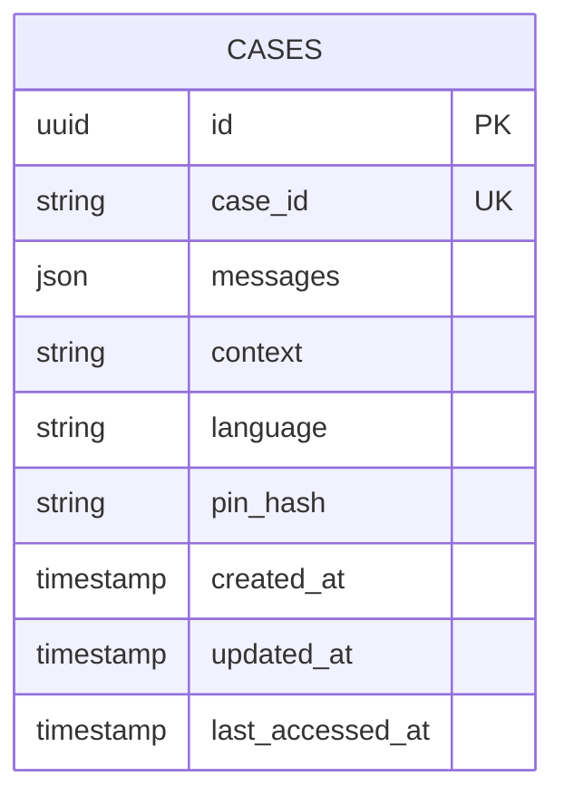
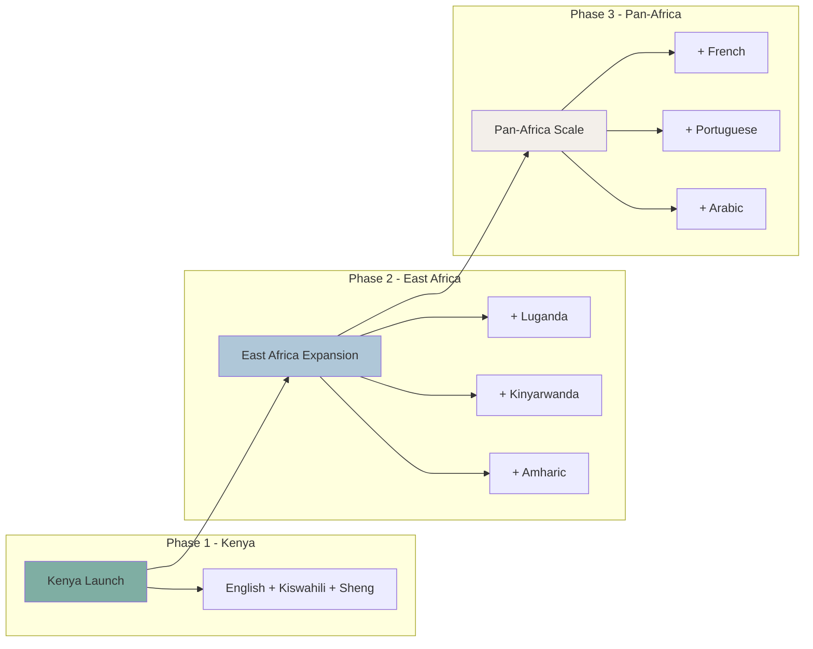

# Tunza - Trauma-Informed GBV Support Platform



**A safe, dignified first step for survivors and witnesses of gender-based violence in Kenya.**

🌐 **Live Demo**: [https://tunza.lovable.app](https://tunza.lovable.app)

---

## 📋 Table of Contents

- [Problem Statement](#-problem-statement)
- [Our Solution](#-our-solution)
- [Target Audience](#-target-audience)
- [Key Features](#-key-features)
- [User Workflow](#-user-workflow)
- [Technical Architecture](#-technical-architecture)
- [System Architecture](#-system-architecture)
- [Scalability](#-scalability)
- [Impact](#-impact)
- [Getting Started](#-getting-started)
- [Tech Stack](#-tech-stack)
- [Contributing](#-contributing)

---

## 🎯 Problem Statement

Gender-based violence (GBV) affects **45% of women in Kenya** at some point in their lives. Yet survivors face significant barriers to seeking help:

- **Fear of judgment** and social stigma
- **Lack of privacy** in traditional reporting channels
- **Language barriers** - many platforms don't support local languages like Kiswahili or Sheng
- **Trauma from re-telling** their story to multiple people
- **Distrust of formal systems** that feel cold or institutional
- **No support for witnesses** who notice concerning situations but don't know how to help

Most existing solutions are **report-first** platforms that pressure users into formal processes before they're ready, causing many to disengage entirely.

---

## 💡 Our Solution

**Tunza** (Swahili for "to care for" or "to nurture") is a **trauma-informed, voice-first support platform** that creates a safe space for survivors and witnesses to:

1. **Share their experience** through voice or text in their preferred language
2. **Receive empathetic AI support** trained in trauma-informed care
3. **Access resources and help** at their own pace, without pressure
4. **Connect with professional support** only when they choose to

### Core Principles

| Principle | Implementation |
|-----------|----------------|
| **Safety First** | No login required, discreet app design, quick exit button |
| **User Control** | Every action is optional, users can pause/resume anytime |
| **Cultural Sensitivity** | Supports English, Kiswahili, and Sheng |
| **Trauma-Informed** | One question at a time, no assumptions, validation-focused |
| **Privacy by Design** | Minimal data collection, encryption, user-controlled retention |

---

## 👥 Target Audience

### Primary Users

1. **GBV Survivors** - People who have experienced or are experiencing gender-based violence and need a safe first step
2. **Concerned Witnesses** - Family members, friends, neighbors, or colleagues who notice something concerning
3. **Information Seekers** - Anyone wanting to learn about GBV, warning signs, and available resources

### Demographics

- **Age**: 15-45 years (primary), all ages (secondary)
- **Location**: Kenya (initially), expandable to East Africa
- **Languages**: English, Kiswahili, Sheng (urban youth slang)
- **Tech Access**: Smartphone users with basic internet connectivity

---

## ✨ Key Features

### 🎙️ Voice-First Interaction
- Natural conversation with AI trained in trauma-informed care
- ElevenLabs integration for warm, Kenyan-accented voice responses
- Audio feedback (soft chimes) for clear interaction cues

### 💬 Multi-Language Support
- **English** - Full support
- **Kiswahili** - Native language support
- **Sheng** - Urban youth dialect with careful, respectful handling

### 🛡️ Safety & Privacy
- No login or account required
- Quick exit button for emergency situations
- Case-based system (not user-based) for anonymity
- User-controlled data retention with auto-deletion

### 🚨 Smart Risk Detection
- Silent background analysis of conversation content
- Escalation options presented only when user is ready
- Emergency resources without forced reporting

### 📱 Progressive Web App
- Installable on any device
- Works offline for core functionality
- Discreet app icon and name

---

## 🔄 User Workflow



### Seven-Phase Journey

| Phase | Name | Description |
|-------|------|-------------|
| 0 | **First Contact** | Calming entry screen with 4 equal-weight options |
| 1 | **Choose Engagement** | Language selection, preparation for voice/chat |
| 2 | **Conversation Begins** | One question at a time, validation-focused |
| 3 | **Risk Awareness** | Silent detection, no visible scoring |
| 4 | **Support Options** | User-driven choices for next steps |
| 5 | **Save & Return** | Case ID system for continuity |
| 6 | **Optional Reporting** | Only when user explicitly chooses |
| 7 | **Exit Safely** | Respectful closure, no trace on screen |

---

## 🏗️ Technical Architecture

### System Overview



### Edge Functions

| Function | Purpose |
|----------|---------|
| `tunza-chat` | Main conversation handler with AI integration |
| `case-manager` | CRUD operations for case data |
| `voice-session` | Voice conversation state management |
| `risk-detector` | Silent risk level assessment |
| `ai-guardrails` | Safety checks before AI responses |
| `consent-engine` | Manages consent state machine |
| `partner-handoff` | Secure handoff to support partners |
| `data-retention` | Auto-deletion and cleanup |
| `intake` | Channel normalization layer |
| `elevenlabs-voice` | Text-to-speech conversion |

### Data Flow



### Database Schema



---

## 📈 Scalability

### Current Architecture Supports

| Metric | Capacity |
|--------|----------|
| Concurrent Users | 10,000+ |
| Messages/Second | 1,000+ |
| Data Retention | Configurable (30 days default) |
| Languages | 3 (extensible) |

### Scaling Strategy



### Multi-Channel Roadmap

- ✅ **PWA** (Voice + Text) - Launched
- 🔜 **SMS** - Low-bandwidth access
- 🔜 **USSD** - Feature phone support
- 🔜 **WhatsApp** - Familiar interface
- 🔜 **Voice Calls** - VoIP integration

---

## 🌍 Impact

### Immediate Impact

- **Lower barrier to seeking help** - No login, no pressure, user's choice
- **Dignified first disclosure** - Trauma-informed AI that validates feelings
- **Support for witnesses** - Dedicated flow for concerned observers
- **Language inclusion** - Sheng support reaches urban youth often excluded

### Measurable Outcomes

| Metric | Goal |
|--------|------|
| Users reached | 10,000 in Year 1 |
| Conversations completed | 50% completion rate |
| Partner referrals | 1,000+ warm handoffs |
| Crisis interventions | 100+ emergency supports |

### Long-Term Vision

1. **Reduce stigma** around seeking GBV support
2. **Create data insights** (anonymized) for policy advocacy
3. **Train local AI models** that understand African contexts
4. **Build ecosystem** of trusted support partners

---

## 🚀 Getting Started

### Prerequisites

- Node.js 18+ 
- npm or bun

### Installation

```bash
# Clone the repository
git clone <YOUR_GIT_URL>

# Navigate to project directory
cd tunza

# Install dependencies
npm install

# Start development server
npm run dev
```

### Environment Variables

The project uses Lovable Cloud, which automatically configures:
- `VITE_SUPABASE_URL`
- `VITE_SUPABASE_PUBLISHABLE_KEY`
- `VITE_SUPABASE_PROJECT_ID`

### Build for Production

```bash
npm run build
```

---

## 🛠️ Tech Stack

| Layer | Technology |
|-------|------------|
| **Frontend** | React 18, TypeScript, Vite |
| **Styling** | Tailwind CSS, shadcn/ui |
| **State** | React Query, React Hooks |
| **Backend** | Supabase Edge Functions (Deno) |
| **Database** | PostgreSQL (Supabase) |
| **AI** | Lovable AI, OpenAI GPT |
| **Voice** | ElevenLabs TTS, Web Audio API |
| **Deployment** | Lovable Cloud |

---

## 🤝 Contributing

Tunza is built with love for the people of Kenya. We welcome contributions that align with our trauma-informed, user-first principles.

### Guidelines

1. **Respect the design system** - Use semantic tokens, follow the calm UI principles
2. **Maintain trauma-informed language** - No triggering words in early flows
3. **Test with empathy** - Consider how vulnerable users will experience changes
4. **Document thoroughly** - Help future contributors understand decisions

---

## 📄 License

This project is open source and available under the MIT License.

---

## 🙏 Acknowledgments

- Built with [Lovable](https://lovable.dev)
- Voice powered by [ElevenLabs](https://elevenlabs.io)
- Inspired by the resilience of Kenyan communities

---

<p align="center">
  <strong>Tunza</strong> - Because everyone deserves a safe first step.<br/>
  <em>"Hakuna mtu anayestahili kupitia hii peke yake"</em><br/>
  (No one deserves to go through this alone)
</p>
